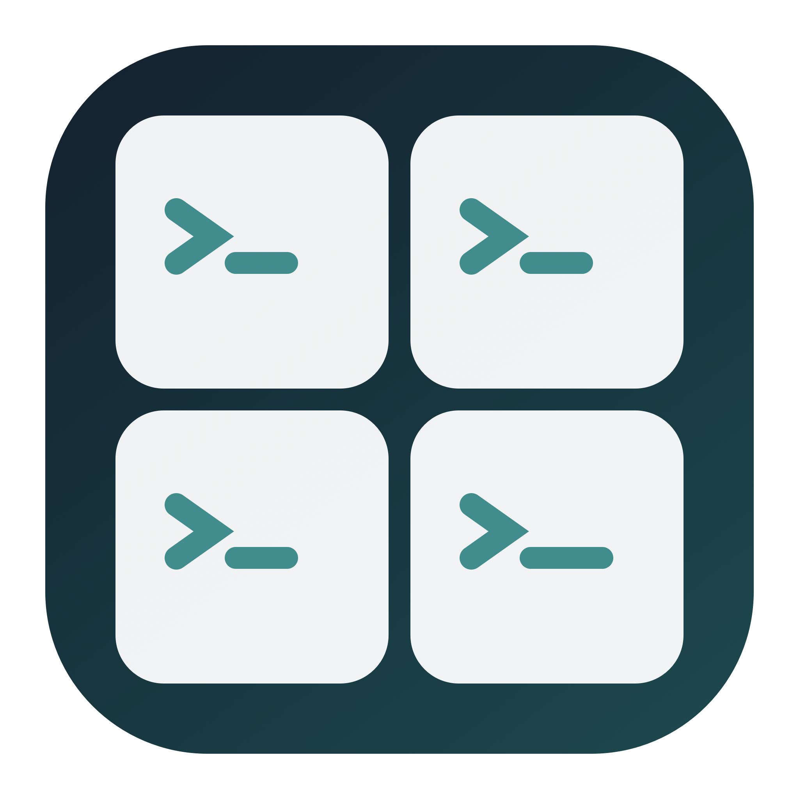

<div align="center">
  
  <h1>TermYes</h1>
  <p><strong>终端统一管理，危险指令及时拦截。</strong></p>
  <p>面向系统 Terminal 与 Agent 命令守卫的原生 macOS 菜单栏工具。</p>
  <p>
    <a href="https://github.com/zzusec/TermYes/actions/workflows/build.yml"></a>
    
    
  </p>
  <p><a href="README.md">English</a> · <strong>简体中文</strong></p>
  <p><a href="https://github.com/zzusec/TermYes/releases/latest">下载安装</a> · <a href="RELEASE_NOTES.md">更新说明</a> · <a href="AgentGuard/README.md">守卫详细说明</a></p>
</div>

TermYes 将 **Termosaic 的终端画布**与 **bypass-yes 的命令守卫**整合到一个应用：集中查看现有 Terminal 会话，隐藏窗口但不中断进程，并在菜单栏统一安装或恢复各 Agent 的 Shell 守卫。

> **先自动进入 YOLO，再硬拦危险。** TermYes 会检测已安装的 Agent，把支持权限模式的客户端修复为 YOLO/等效免确认，只支持启动参数的客户端使用受管 wrapper；危险命令仍由失败关闭的守卫硬拒绝。适配器 Hook 的真实客户端行为仍需验证。

## 主要功能

- **一张终端画布。** 系统 Terminal 窗口无缝平铺：四个窗口组成 2×2，六个组成 3×2，奇数个窗口按左列多一个的两列排布；新增或关闭窗口后自动重排，保持稳定的顺时针顺序。
- **明确的 Shell 危险清单与夜间静音。** Shell 守卫仅拒绝 GitHub 上版本化的 `AgentGuard/danger-policy.json`（离线时使用已验证缓存或内置规则）及 `AgentGuard/core.py` 中 `rm -rf` 目标分级命中的命令；有效命令未命中清单就放行，不让 AI 二次否决。22:00–08:00 静音只关闭提示音，不降低拦截强度。
- **减少桌面干扰。** 窗口一起显示或隐藏，包含最小化窗口，内部进程继续运行。不显示 Dock 图标，不嵌入 Shell，不创建常驻控制窗口，也不调整其他应用的窗口。
- **快捷键呼出。** 可配置全局快捷键，默认 `⌘O`；若要保留其他应用的“打开”命令，请修改它。
- **统一管理 Agent 安全。** TermYes 启动时及此后每 5 分钟检查已检测到的 Agent，维护 YOLO/等效权限模式并安装、更新危险 Shell 命令守卫；被外部修改的守卫不会自动覆盖。
- **以实测确认 Agent 状态。** 展开「命令守卫」可分别查看配置、真实请求与守卫加载结果。只有 YOLO/等效免确认、安全 Shell 执行和客户端实际调用守卫均通过，才显示勾选；安装文件或修复配置不等于就绪。单项和全面实测会产生模型请求，失败原因可查看、滚动与复制。
- **启动前双重检查。** 新开的 zsh 终端会在启动 Agent 前检查守卫配置与 YOLO；检查失败会拒绝启动。守卫文件就绪不等于客户端实际加载并信任 Hook。
- **应用内更新。** 通过公开 GitHub Release 跳转检查版本（不占用匿名 API 配额），下载对应版本的安装包，验证校验和与应用签名，保留备份后替换并重新启动。

## 安装

支持 **macOS 13+**，同时提供 Apple Silicon 与 Intel 架构。

1. 从 [GitHub Releases](https://github.com/zzusec/TermYes/releases/latest) 下载已发布版本；本地 v1.6.22 构建产物位于 `dist/TermYes-v1.6.22-macOS.dmg`。
2. 打开安装包，将 **TermYes.app** 拖入 **Applications**。
3. 启动 TermYes，按提示允许控制 Terminal：
   **系统设置 → 隐私与安全性 → 自动化 → TermYes → Terminal**。
4. 点击菜单栏四宫格图标，在「自动排列」中选择「显示终端」。

社区版本采用 ad-hoc 签名，尚未经过 Apple 公证。如果 macOS 阻止首次启动，请在确认信任该版本后使用系统针对该应用的“仍要打开”流程；不需要关闭系统级安全保护。

窗口管理功能不需要 Python 或 Node.js。可选的**命令守卫模块**需要可用的 `/usr/bin/python3`，开发机上由 Xcode Command Line Tools 提供；应用不会自动安装依赖。在线更新需要网络连接。

### 从 Termosaic 升级

GitHub 仓库现更名为 **`zzusec/TermYes`**。旧的 Termosaic 链接会重定向到新仓库；Bundle ID、配置目录和兼容安装包名称保持不变。

- Bundle ID、已保存偏好、守卫运行目录和恢复记录沿用原标识，不因改名主动清空；macOS 仍可能再次请求自动化权限。
- v1.6.22 另有 **`Termosaic-v1.6.22-macOS.dmg` 旧版更新兼容包**。二者包含相同的已签名 TermYes 应用，仅外层应用目录名对应不同更新器的预期；发布版本时与正式安装包一同上传。
- 自动升级后，安装目录可能仍叫 `Termosaic.app`，应用显示名称则为 **TermYes**。请勿同时运行新旧两个副本。
- 安装守卫不会删除原 bypass-yes 仓库；新安装的运行文件不再依赖该仓库。

## 使用终端画布

| 菜单操作 | 快捷键 |
| --- | --- |
| 全局呼出并重新平铺 | 默认 `⌘O`，可修改 |

切换到其他应用时会隐藏画布；隐藏窗口不会停止窗口内的进程。TermYes **只管理 Apple 系统 Terminal.app**，不管理 iTerm2 或其他终端模拟器。

在「自动排列」中可显示或隐藏终端；配置的全局快捷键用于呼出并在鼠标所在显示器重新平铺。TermYes 不会向现有 Agent 会话自动或手动发送「继续」。

**定时激活5h窗口 → 设置时间**可设置起始时间，勾选 Claude、Codex 或两者。TermYes 运行期间每五小时检查所选 Agent 的守卫，再打开专用 Terminal 窗口发送 `hi`，并在窗口中显示模型的实际回复；不向正在工作的会话注入输入，也不再额外发送第二个后台请求。只有取得成功退出状态和回复才显示激活成功，失败原因可查看。**立即激活一次（发送 hi）**与 Timer 共用同一条执行路径，可不等五小时直接验收。请求可能产生模型费用；成功不能保证供应商或账号的额度窗口重置，应用退出后不会定时触发。

## Agent 命令守卫

TermYes 启动后每 5 分钟检查检测到的客户端，并维护 YOLO/等效权限模式与命令守卫文件。在「命令守卫」菜单可查看各项配置与实测状态，修复配置后仍需实测通过才能打钩；守卫更新后请重启对应客户端，Codex 还需要在 `/hooks` 中检查并信任新 Hook。

内置适配器覆盖 Claude Code、Codex、CodeBuddy、zcode、pi、Qoder、Gemini CLI、Cursor、agy、OpenCode、Factory droid、Crush 和 GitHub Copilot CLI。

### 策略与当前状态

| 情况 | TermYes 的处理 |
| --- | --- |
| 命中危险或警告规则 | 直接拒绝，不弹确认 |
| 输入无效，或捕获到守卫/桥接错误 | 返回拒绝，不静默放行 |
| 未命中危险规则 | 交回客户端原有权限流程 |
| 检测到客户端 | 修复 YOLO/等效权限模式并安装命令守卫；Hook 实际加载仍需验证 |
| 安装后文件被外部修改 | 拒绝自动覆盖或恢复 |

**“已安装”不等于“正在受保护”。** 所有适配器目前均处于真实客户端待验证状态；Copilot 的宿主超时处理与 agy 的 turbo 模式存在已知或尚未解决的兼容性问题。Hook 未加载、未信任、被禁用或宿主超时，都可能使守卫失效。

这是 **Shell 命令文本的事故防护层，不是沙箱**。它无法完整理解任意 Python、SQL、远程程序、别名或脚本的实际行为，也不拦截独立的文件编辑或 MCP 工具。`safe` 只表示“未命中规则”，不是“已经证明安全”。

安装器合并默认用户级配置、保留其他 Hook，并保存私有恢复记录；启动协调会开启受支持的 YOLO/等效权限模式，只能通过启动参数控制的客户端使用受管 wrapper。不管理自定义配置根目录或项目级配置。路径、错误边界和命令行用法见[守卫文档](AgentGuard/README.md)。

**不提供 Ctrl-C 自动确认或 AI 审批。** 普通命令采用 YOLO／等效免确认，危险命令按清单硬拦截；原生 Ctrl-C 与业务弹窗保持人工操作。

## 源码构建与测试

构建需要 Xcode Command Line Tools。守卫测试使用 Python；插件测试需要已安装、支持 `node:module.stripTypeScriptTypes` 的 Node.js，CI 使用 Node.js 24。

```sh
# 只构建，不替换已安装应用。
SKIP_INSTALL=1 ./build.sh

# 生成主安装包、旧版兼容包及可移植的 SHA-256 校验文件。
./create-dmg.sh
/usr/bin/python3 -B Tests/test_release.py
```

应用位于 `build/TermYes.app`；安装包和校验文件位于 `dist/`。直接运行 `./build.sh`、**不设置** `SKIP_INSTALL=1` 时，会安装到 `/Applications/TermYes.app`。

```sh
PYTHONDONTWRITEBYTECODE=1 /usr/bin/python3 -B Tests/test_agent_guard.py
PYTHONDONTWRITEBYTECODE=1 /usr/bin/python3 -B Tests/test_quiet_hours.py
bash AgentGuard/test.sh
PYTHONDONTWRITEBYTECODE=1 bash AgentGuard/test-codex.sh
node Tests/test_guard_plugins.mjs
swiftc Sources/FiveHourActivation.swift Tests/FiveHourActivationTests.swift -o /tmp/termyes-activation-tests
/tmp/termyes-activation-tests
swiftc Sources/GridLayout.swift Tests/main.swift -o /tmp/termyes-grid-tests
/tmp/termyes-grid-tests
swiftc Sources/SemanticVersion.swift Tests/VersionTests.swift -o /tmp/termyes-version-tests
/tmp/termyes-version-tests
swiftc Sources/SemanticVersion.swift Sources/GitHubReleaseLocation.swift Tests/ReleaseLocationTests.swift -o /tmp/termyes-release-location-tests
/tmp/termyes-release-location-tests
bash Tests/test_update_installer.sh
```

守卫测试只分类命令字符串，不执行危险指令。插件测试模拟宿主 API，不代表真实客户端 YOLO 模式已通过验证。发布测试只读挂载安装包，并在临时副本上测试更新器，不启动应用。

## 更新、隐私与许可

TermYes 在启动后及之后每两小时检查公开 GitHub Release；仅发布更高版本的正式 Release 时自动安装。自动替换要求应用位于 `/Applications` 下，且当前用户有写入权限。校验和及递归严格 `codesign` 验证用于检测包损坏或不一致；ad-hoc 签名不等于 Apple 开发者身份认证。

危险清单独立维护在 GitHub 仓库的 `AgentGuard/danger-policy.json`：在 `main` 分支修改 `block`/`warn` 正则与说明，**递增整数 `version` 并发布文件**，已安装新版 TermYes 在启动及运行期间每两小时检查一次（菜单可立即检查）；发现更高版本时校验结构、大小、正则及来源后原子更新本机清单，新 Hook 调用立即使用，不需重装客户端。相同版本修改不会生效；回退版本、下载失败或无效数据保留上一份有效规则。若缓存无效，则回退到内置清单，菜单显示错误。`rm -rf` 路径分级仍随应用代码发布，不能通过 JSON 修改。关闭 TermYes 后不会定时联网；重新打开会继续检查。旧版客户端须先安装支持此功能的新版应用。

没有分析统计、账户体系、广告或遥测。应用联网仅用于公开应用版本与危险清单检查、下载；守卫安装和 Terminal 自动化都在本地进行。恢复记录可能含已有客户端配置中的敏感值，请勿分享。

采用 [MIT 许可](LICENSE)，迁入的守卫模块保留其[原始 MIT 许可](AgentGuard/LICENSE)。
